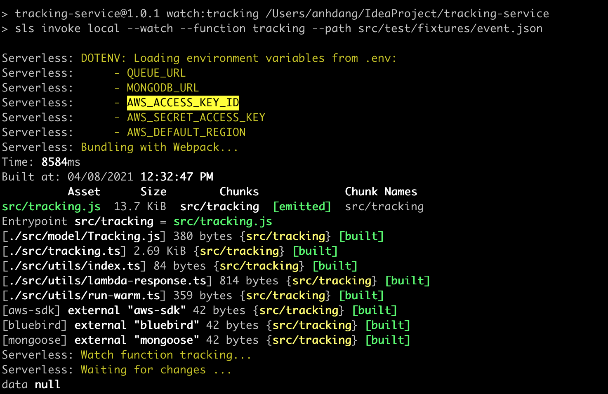

# iCommerce Project

## Tracking Service

This service is simple serverless lambda for tracking view/search products.
Built on top of Serverless framework, typescript, webpack to build. linting with EsLint, prettier for formatting. This structure will make lambda function run, deploy, scale faster.

## Install

```bash
# Install serverless cli installed, do that
yarn global add serverless

# cd into project
cd tracking-service

# Install dependencies
yarn install
```

AWS lambda authorization key can be added local at .env or serverless.yml

Serverless will load environment variables from .env:


## Structure

#### 1. All functions will start from the serverless.yml

In the functions section of [`./serverless.yml`](./serverless.yml), you have to add your new function like so:

```yaml
functions:
  tracking:
    handler: src/tracking.default
    events:
      - http:
          path: tracking
          method: post
```

#### 2. Tracking function

[`./src/tracking.ts`](./src/tracking.ts) is the basic funtion built to run isolated. This function will receive tracking data events from inventory services.

#### 3. Database

This repo I use Cloud DBaaS MongoDB Atlas Database. Config can be load from .env. Or we can use mongo local by replacing connectionURL.

### Development live-reloading functions

To run the tracking function:

```bash
yarn watch:tracking
```

With this setup, there can be many services we can put on the same repo but run and deploy seprately. This will help reuse source code and reduce testing.

### API Gateway-like local dev server

To spin up a local dev server that will more closely match the API Gateway endpoint/experience:

```bash
yarn serve
```

### Test your functions with Jest

```bash
yarn test
```

### Keep your lambda functions warm

Lambda functions will go "cold" if they haven't been invoked for a certain period of time (estimates vary, and AWS doesn't offer a clear answer).

> Cold start happens when you execute an inactive (cold) function for the first time. It occurs while your cloud provider provisions your selected runtime container and then runs your function. This process, referred to as cold start, will increase your execution time considerably.

A frequently running function won't have this problem, but you can keep your function running hot by scheduling a regular ping to your lambda function. Here's what that looks like in your `serverless.yml`:

```yaml
custom:
  warmup:
    enabled: true
    events:
      - schedule: rate(5 minutes)
    prewarm: true
    concurrency: 2
```

## Inventory Service
https://github.com/anhdn/inventory-service
